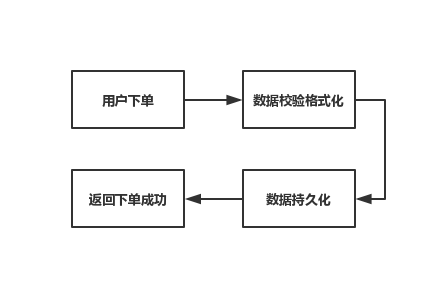
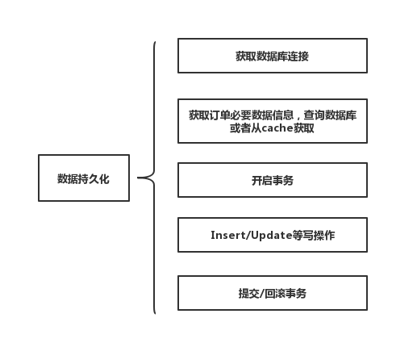
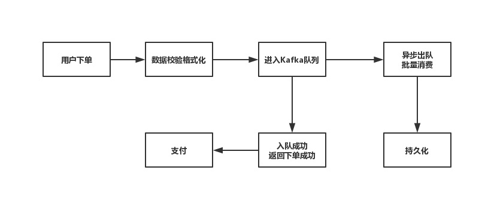

中期考核项目文档
==============

本项目实现了一个简单的商城购物系统，功能包括基本的商品浏览，将商品添加至购物车以及下单等功能，下单流程考虑秒杀等场景，支持一定程度的并发。

项目使用的框架
------------

* 前端：React、Ant-Design
* 后端：Spring Boot
* 数据库：MongoDB
* 消息中间件：Kafka

主要功能
-------

1. 商品页面功能包括商品的查询（基于数据库分页），关键字搜索，添加至购物车。

2. 购物车页面功能包括改变商品数量，移出购物车，计算购物车内商品总金额。购物车内数据也存储于MongoDB。

3. 下单功能，后端根据购物车内商品数据生成订单及唯一订单号。订单先进入消息中间件而不是直接进行数据库操作。后端批量消费中间件中的消息进行数据库操作。

下单流程分析
----------

### 问题场景分析 ###

下单功能问题通常出现在秒杀、抢购等集中下单的高并发场景。由于数据库的写性能通常只能达到4000次/秒，相对于秒杀场景下几万单每秒的下单速率，显然数据库无法满足下单处理效率需求而造成下单响应的缓慢。同时，巨大的并发读写压力可能引起数据库发生各种未知错误，效率下降甚至宕机等问题。如果在订单信息持久化，即订单信息插入数据库部分不做优化，而是直接对数据库进行频繁的读写操作，数据库则很有可能成为整个服务中第一个垮掉的部分。

### 一般下单流程图 ###

  
在简单的下单事务流程中，很明显事务容易阻塞在数据持久化操作上。

### 数据持久化一般流程图 ###

  
即使是最简单的一次数据持久化操作，都可能需要网络连接，IO操作等多个环节会造成延迟，即使是单纯的写数据库IO操作，在高并发环境下也会造成数据库操作出现错误，超时等情况。

### 本项目下单流程图 ###

  
在本项目的下单流程中，通过引入消息队列中间件Kafka，将格式化之后的订单送入Kafka中。由于Kafka优秀的写入性能（最高可达每秒百万级别），可以较好地处理秒杀期间的并发量，将订单写入Kafka的队列中，写入成功即返回给客户端下单成功答应，随即引导用户支付。同时，依据数据库可以健康承载的并发量，异步出队批量消费Kafka中的数据，保证数据库正常健康运行的基础上持续消费数据，直到Kafka队列中数据消费完毕，从而达到削峰的目的，缓解数据库压力的同时大大减少了用户的等待时间。

* 优点
  1. 削峰，缓解数据库写入压力，让数据库在健康的并发量范围内运行，保证数据库可靠性。

  2. 加快了请求的响应时间，写入Kafka队列成功即可响应。

* 缺点
  1. 用户支付与订单持久化操作无法保证绝对一致性，当订单并发数量较多时，存在用户已支付而订单尚未入库或入库失败的情况。

  2. 需要额外的处理逻辑保证订单入库与支付的一致性，实现较为复杂。

### 保证订单与支付一致性解决方案 ###

* 建立一个定时任务，将回调回来的支付成功却在数据库中无法查到对应信息的订单加入该定时任务的缓存中存储。定时遍历该任务中的订单信息进行数据库查询，若查到则进行支付成功的信息更新，若多次查询无果则视为订单信息丢失，根据支付回调的订单信息重新加入Kafka队列进行持久化操作。

* 此类订单在定时任务执行的过程中，用户无法查询到订单的状态信息。

附录
----

### 接口示例 ###

#### 商品信息分页查询接口 ####

**URL：** /goods/{page}  
**返回格式：** json
**请求方式：** HTTP GET  
**请求示例：** `http://address/goods/1`  
**请求参数说明**
| 名称 | 类型 | 说明 |
| - | - | - |
| page | int | 分页查询的页号，从1开始 |
**返回参数说明**
| 名称    | 类型   | 说明     |
| -      | -      | -       |
| code   | string | 应答码   |
| msg    | string | 应答信息 |
| result | object | 结果集   |
