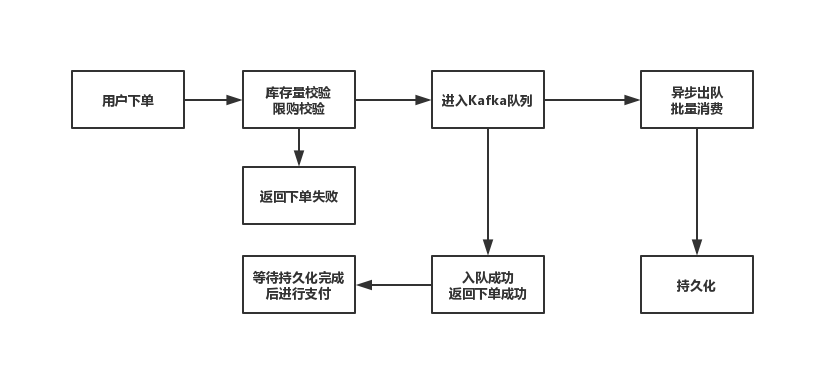
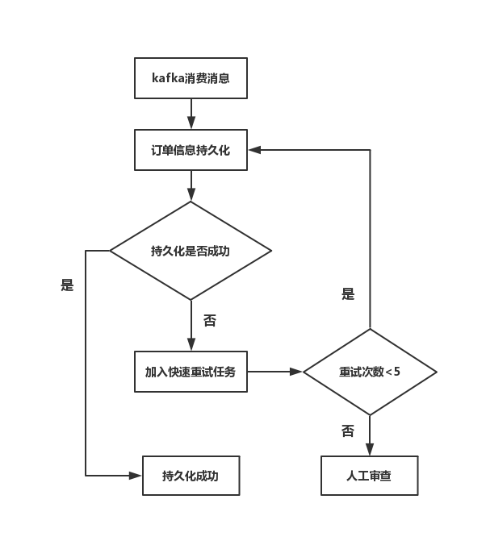

系统技术说明
===========

项目使用的框架
------------

* 前端：React、Ant-Design
* 后端：Spring Boot, fastjson, log4j
* 数据库：MongoDB
* 消息中间件：Kafka

前端技术说明
-----------

前端使用React作为整体框架，使用Ant-Design作为UI组件库，前端通用功能组件使用Ant-Design中的组件，其余页面布局及逻辑代码，简易版全局状态控制及回调均为从零搭建。

后端技术说明
-----------

后端使用Spring Boot作为整体框架，搭配了fastjson和log4j等辅助性工具库。主要为前端提供业务功能接口，与消息中间件和数据库交互，同时完成一些特殊的业务逻辑功能，如登录状态验证，定时任务等。

数据库技术说明
------------

数据库使用的是MongoDB，商品数据，购物车信息及订单信息均存储于其中。

消息中间件技术说明
----------------

消息中间件使用Kafka，用户下单后订单会进入消息中间件以一定的速率批量消费，在高并发场景下可缓解数据库压力，同时优化用户体验。项目中Kafka使用了3个实例节点组成一个集群，同时将每个消息主题分为3个分区，此时消息会较为均衡地分发到3个节点上进行入队和消费，在后端使用三个线程分别监听三个节点，可以较好地提高并发性能。

系统功能概述
===========

本项目实现了一个简单的商城购物系统，功能包括基本的商品浏览与搜索，购物车以及下单、订单展示等业务功能，下单流程考虑秒杀等场景，支持一定程度的并发。

主要业务功能
----------

1. 用户的登录登出功能。

2. 商品页面功能包括商品的查询（基于数据库分页），关键字搜索，添加商品至购物车。

3. 购物车页面功能包括改变商品数量，移出购物车，计算购物车内商品总金额。购物车内数据也存储于数据库。

4. 下单功能，后端根据购物车内商品数据生成订单及唯一订单号。订单先进入消息中间件而不是直接进行数据库操作。后端批量消费中间件中的消息进行数据库操作。

登录登出验证实现
--------------

使用Token验证登录状态，前后端分别实现：

### 前端实现方法 ###

前端使用axios发送HTTP请求，在请求登录接口得到返回的Token后存储在LocalStorage中，在发送其他请求时，使用统一拦截器在请求的Header中添加Token信息，提供给后端进行验证。同时，在前端组件渲染时，可以根据LocalStorage中的Token值是否存在，来对组件进行条件渲染，以达到访问控制的目的。

### 后端实现方法 ###

后端在Spring Boot框架中，自定义注解 ***@AuthRequired*** ，在需要进行权限控制的HTTP请求方法前都加上该注解。同时，使用Spring中的AOP概念，对 ***@AuthRequired*** 注解织入环绕切面方法，在请求方法执行前后执行，验证请求的Header中是否带有Token信息及其有效性，若有效则继续请求，若Token信息无效则直接返回未登录应答。

下单流程分析
----------

### 问题场景 ###

下单功能问题通常出现在秒杀、抢购等集中下单的高并发场景。由于数据库的写性能通常只能达到4000次/秒，相对于秒杀场景下几万单每秒的下单速率，显然数据库无法满足下单处理效率需求而造成下单响应的缓慢。同时，巨大的并发读写压力可能引起数据库发生各种未知错误，效率下降甚至宕机等问题。如果在订单信息持久化，即订单信息插入数据库部分不做优化，而是直接对数据库进行频繁的读写操作，数据库则很有可能成为整个服务中第一个垮掉的部分。

### 一般下单流程图 ###

  
在简单的下单事务流程中，各功能按流程进行，同步等待，很明显事务容易阻塞在数据持久化操作上。

### 数据持久化一般流程图 ###

  
即使是最简单的一次数据持久化操作，都可能需要网络连接，IO操作等多个环节会造成延迟，即使是单纯的写数据库IO操作，在高并发环境下也会造成数据库操作出现错误，超时等情况。

### 本项目下单流程图 ###

  
在本项目的下单流程中，通过引入消息队列中间件Kafka，将格式化之后的订单送入Kafka中。由于Kafka优秀的写入性能（最高可达每秒百万级别），可以较好地处理秒杀期间的并发量，将订单写入Kafka的队列中，写入成功即返回给客户端下单成功答应，随即引导用户支付。同时，依据数据库可以健康承载的TPS，异步出队批量消费Kafka中的数据，保证数据库正常健康运行的基础上持续消费数据，直到Kafka队列中数据消费完毕，从而达到削峰的目的，缓解数据库压力的同时大大减少了用户的等待时间。

* 优点
  1. 削峰，缓解数据库写入压力，让数据库在健康的并发量范围内运行，保证数据库可靠性。

  2. 加快了请求的响应时间，写入Kafka队列成功即可响应，用户体验良好。

* 缺点
  1. 用户下单成功与订单持久化操作无法保证绝对一致性，当订单并发数量较多时，存在用户已收到下单成功的信息而订单尚未入库或入库失败的情况。

  2. 需要额外的处理逻辑保证返回订单成功与持久化的一致性，实现较为复杂。

### 保证成功订单持久化 ###

#### 订单异步持久化存在的问题 ####

由于订单的持久化工作是异步执行，而订单在进入Kafka队列后系统即返回下单成功，由于高并发场景下，订单持久化可能耗时相对较长，甚至出现某些问题持久化失败，而此时用户已经收到了返回下单成功的信息，即会出现订单延迟查询或查询不到的情况。

#### 解决办法 ####

* 建立一个定时任务，将持久化操作失败的订单加入该定时任务的缓存中存储。定时遍历该任务中的订单信息进行数据库持久化操作，若成功则从缓存中删除，若失败则继续存储等待下次遍历，当被遍历次数超过一定次数时，则视为异常订单，进行收集存储后人工查看。

* 此类订单在定时任务执行的过程中，用户无法查询到该订单信息，可在前端页面提示由于访问量较大存在订单显示延迟的信息。

#### 流程图 ####



数据库设计文档
============

数据库使用的是MongoDB，属于NoSql数据库中的文档型数据库，单条记录的存储格式类似于JSON的富文档格式。

商品信息数据格式
--------------

``` json
{
  "id" : "0",
  "title" : "一号商品",
  "des" : "商品介绍",
  "sales" : "101",
  "price" : "35",
  "img" : "dKbkpPXKfvZzWCM.png"
}
```

购物车信息数据格式
----------------

``` json
{
  "id" : "1",
  "title" : "二号商品",
  "des" : "商品介绍",
  "amount" : "1",
  "price" : "135"
}
```

订单信息数据格式
--------------

``` json
{
  "orderId" : "2019081216257793",
  "totalPrice" : "1505",
  "status" : "1",
  "itemList" : [
    {
      "id" : "0",
      "title" : "一号商品",
      "amount" : "1",
      "price" : "35"
    },
    {
      "id" : "1",
      "title" : "二号商品",
      "amount" : "1",
      "price" : "135"
    },
    {
      "id" : "3",
      "title" : "三号商品",
      "amount" : "1",
      "price" : "1335"
    }
  ]
}
```

抢购商品数据格式
--------------

``` json
{
  "title" : "周杰伦上海演唱会",
  "limit" : 2,
  "days" : [
    {
      "string" : "周六",
      "places" : [
        {
          "string" : "内场",
          "price" : 2160,
          "remain" : 200
        },
        {
          "string" : "外场",
          "price" : 1199,
          "remain" : 500
        },
        {
          "string" : "山顶",
          "price" : 599,
          "remain" : 800
        }
      ]
    },
    {
      "string" : "周日",
      "places" : [
        {
          "string" : "内场",
          "price" : 2060,
          "remain" : 200
        },
        {
          "string" : "外场",
          "price" : 999,
          "remain" : 500
        },
        {
          "string" : "山顶",
          "price" : 499,
          "remain" : 800
        }
      ]
    }
  ]
}
```

性能测试问题分析及解决过程
======================

使用JMeter进行并发性能测试，在测试过程中发现如下问题：

1. 在进行并发量不高（10线程），总样本数量不大（共1万个）的并发测试时，系统表现良好，吞吐量超高。
2. 当把并发量提高到50线程，总样本量维持在1万个时，系统表现只出现轻微下降。  
3. 继续提高线程数到100，总样本量到5万个时：

   1. 系统出现不低的错误率，***后端无报错***。
   2. 系统的吞吐量在测试刚启动时飙高，几秒后样本数量到达一万七千左右便开始出现大幅不断下滑，至一定数值后平稳至结束。

SpringBoot框架内置的Tomcat，默认的线程数是200，连接数是10000，从理论上来说，100个线程的并发请求并不会导致SpringBoot出现问题，

初步压力测试结果
--------------

| 序号 | 线程数 | 循环次数 | 样本数 | 平均值 | 中位数 | 99%百分位 | 最大值 | 异常% | 吞吐量 |
| :-: | :-: | :-: | :-: | :-: | :-: | :-: | :-: | :-: | :-: |
| 1 | 10 | 1000 | 10000 | 2 | 2 | 8 | 93 | 0.00% | 3385/s |
| 2 | 50 | 200 | 10000 | 5 | 6 | 12 | 81 | 0.00% | 3010/s |
| 3 | 100 | 500 | 50000 | 90 | 10 | 364 | 17577 | 5.29% | 1056/s |

### 错误信息 ###


问题排查与解决
------------

1. 首先考虑后端问题，但是在后端并没有出现报错，打开Tomcat的access_log记录请求日志查看，发现请求数量少于样本数量，即JMeter捕获的错误请求并没有进入Spring后端进行处理。
2. 由于报错是 ***SocketException*** ，考虑是网络层 ***Socket*** 通信的错误。理论上，JMeter发送的连接均为Keep-Alive的长连接，即便有100个线程的并发，100个长连接也并不算多。使用抓包工具Wireshark查看HTTP及TCP连接情况。  
  
可以看到在TCP进行了三次握手建立连接后，仅在该连接上发送了一次HTTP1.1/GET请求，就进行了四次挥手关闭了连接，即5万个样本请求全部为一次独立的TCP连接过程，JMeter线程的每次循环都为独立请求过程。
3. 一个Socket连接由一个五元组可以确定：*源IP*，*源端口*，*目标IP*，*目标端口*以及使用的*协议*。JMeter每建立一个TCP连接都需要有一个本地的端口，本地电脑的端口数量显然无法满足5万个样本。查看测试过程中端口占用情况，结果如图。  
  
可以看到系统中有大量的*TIME_WAIT*状态的端口，由于TCP协议在断开连接时进行四次挥手，主动断开连接的一方会在最后一次挥手后进入*TIME_WAIT*状态，防止因为网络原因对方没有接收到确认消息而断开连接失败，持续时间为*2MSL*。查询本机的内核tcp相关设置情况如图：


本机的*MSL*时间为15秒，即*TIME_WAIT*时间会持续30秒后，才会释放该端口。而端口范围为*49152~65535*，一共一万六千多个端口，这也是为什么样本数量到达一万七千的时候吞吐量会开始大幅下降。只要在测试时将30秒内的请求数量
控制在一万五千以内，就可以解决该问题。  
在并发线程数一定时，要将请求数量降低，需将单个请求的响应时间提高。同时发现由于请求的发送与接收都在本机，请求时间相比于网络请求快出不少，绝大部分甚至在10ms以内，所以导致了短时间内请求数量巨大，端口迅速占满。

> 在并发线程数为100时，要将30s内请求数量控制在1万5千内，单个请求耗时需在200ms以上。

因此，在后端代码中使用 `Thread.sleep()` 将响应时间人为提高到200ms以上，再进行测试，结果如下：

| 序号 | 线程数 | 循环次数 | 样本数 | 平均值 | 中位数 | 99%百分位 | 最大值 | 异常% | 吞吐量 |
| :-: | :-: | :-: | :-: | :-: | :-: | :-: | :-: | :-: | :-: |
| 1 | 10 | 1000 | 10000 | 204 | 205 | 207 | 366 | 0.00% | 48.6/s |
| 2 | 50 | 200 | 10000 | 205 | 205 | 210 | 241 | 0.00% | 237.9/s |
| 3 | 100 | 500 | 50000 | 215 | 209 | 266 | 290 | 0.00% | 459.9/s |

总结
----

1. 主要原因即为JMeter对每个请求样本都视为一个独立的请求过程，从而导致在快速并发时耗尽测试机的可用端口。在单机端口有限的情况下，更大的并发测试只能使用JMeter的分布式测试。

2. 当出现网络连接异常而非服务端业务系统报错时，解决问题对HTTP，TCP/IP，Socket等知识的要求较高。主要可以关注**HTTP协议，TCP连接情况，服务器端口情况，超时设置**等。同时，Wireshark工具抓包很好用。

附录
====

接口信息
-------

### 接口示例：商品信息分页查询 ###

**URL：** /goods/{page}  
**返回格式：** json
**请求方式：** HTTP GET  
**请求示例：** `http://address/goods/1`

**请求参数说明**

| 名称 | 类型 | 说明 |
| - | - | - |
| page | int | 分页查询的页号，从1开始 |

**返回参数说明**

| 名称    | 类型   | 说明         |
| -      | -      | -           |
| code   | string | 应答码       |
| msg    | string | 应答信息     |
| result | object | 结果集       |
| id     | string | 商品id       |
| title  | string | 商品标题     |
| des    | string | 商品描述     |
| img    | string | 商品图片地址  |
| sales  | string | 商品销量     |
| price  | string | 商品价格     |

### 接口合集 ###

| URL | HTTP | 说明 |
| - | - | - |
| /goods/{page} | GET | 商品信息分页查询 |
| /goods/search/{key} | GET | 商品信息关键字查询 |
| /cart/get | GET | 获取购物车数据 |
| /cart/insert | POST | 向购物车插入商品 |
| /cart/delete | POST | 删除购物车中商品 |
| /cart/amount | POST | 修改购物车中商品数量 |
| /order/get | GET | 查询订单 |
| /order/generate | POST | 下单 |
| /order/notify | POST | 支付回调 |
